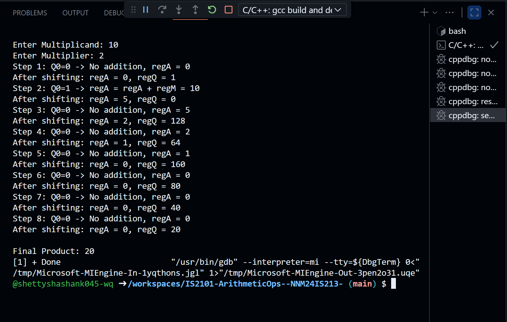
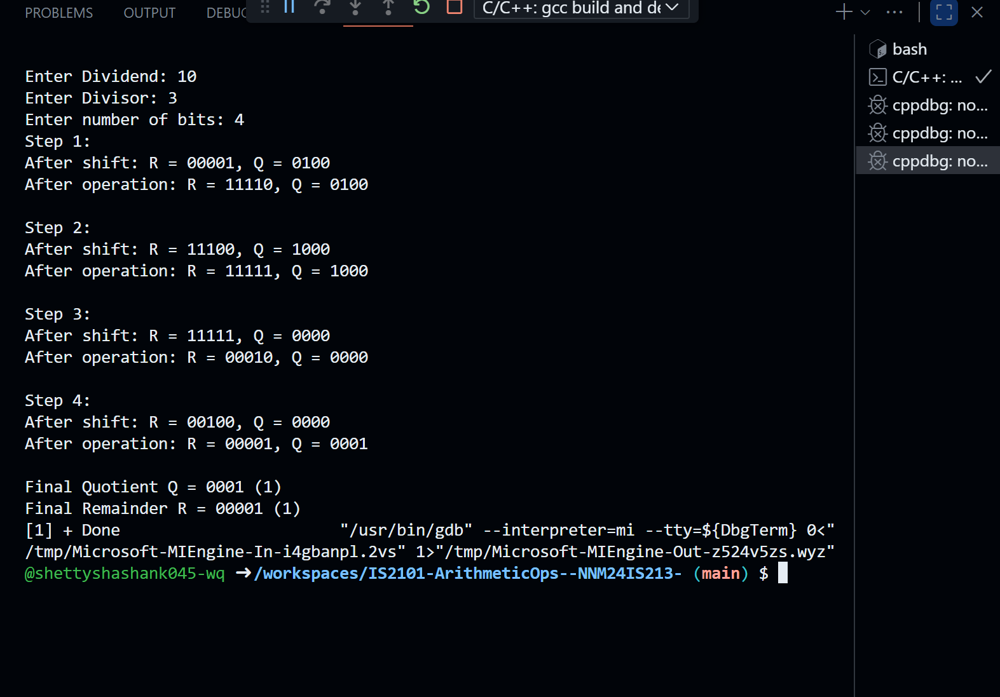
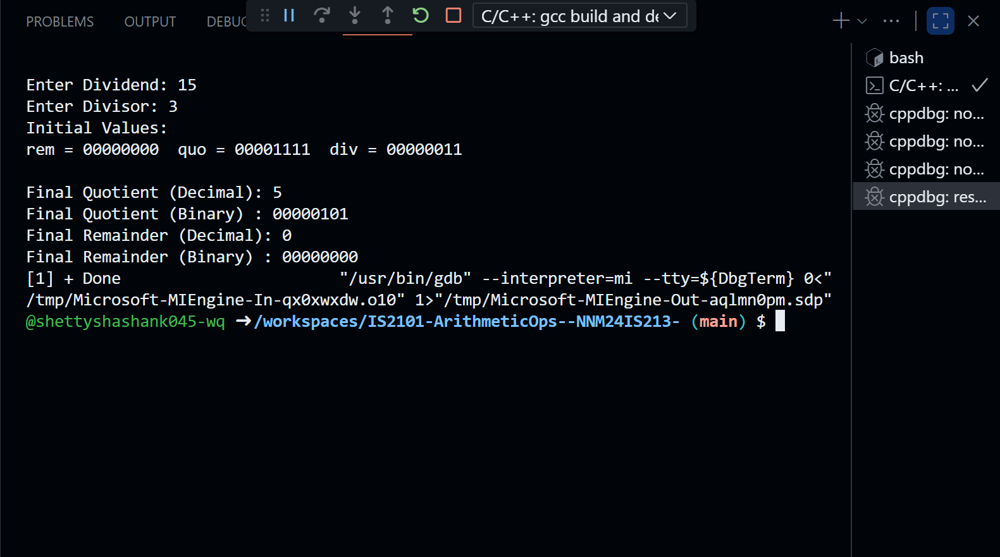

# IS2101-ArithmeticOps--NNM24IS213-
C programs for multiplication and division of signed integers
This repository provides C implementations of three important arithmetic algorithms:

1. **Shift-Add (Sequential) Multiplication**
   - Handles signed integers using 2’s complement form.
   - Demonstrates the multiplication process step by step using shift-and-add.
2. **Restoring Division Algorithm**
   - Performs division using the restoring method.
   - Designed to work with positive numbers.
3. Non-Restoring Division Algorithm
   - An improved version of restoring division that avoids the restore step.
   - Clearly shows each stage (accumulator, divisor, and quotient values).

These programs illustrate how multiplication and division are implemented in computer hardware.
They also highlight efficiency improvements (for example, **non-restoring** division is faster than **restoring** division).
---
## File Structure  
- `ShiftAddMultiplication.c` – Code for sequential multiplication  
- `RestoringDivision.c` – Code for restoring division  
- `Non_Restoring_Algorithm.c` – Code for non-restoring division  
- `README.md` – Project details and instructions  

---

## Compilation and Execution  
```bash
gcc ShiftAddMultiplication.c -o ShiftAddMultiplication
./ShiftAddMultiplication

gcc RestoringDivision.c -o RestoringDivision
./RestoringDivision

gcc Non_Restoring_Algorithm.c -o NonRestoring
./NonRestoring

```
## Output of Shift-Add Multiplication


## Output of Restoring Division


## Output of Non-Restoring Division

